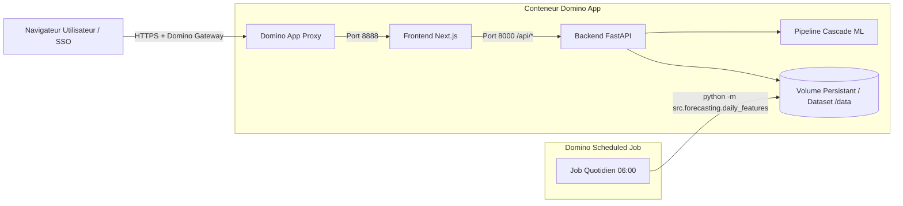

# Guide de Déploiement Domino Data Lab — Organisation du RIE
## BNP Paribas El Djazaïr — Département Data / Intelligence Artificielle

Ce document est destiné à l'équipe **IT & Data Platform** en charge de l'hébergement et de l'exploitation de l'application sur **Domino Data Lab**.

---

## 1. Vue d'ensemble de l'Architecture

L'application **Organisation du RIE** est un système prédictif complet combinant un moteur d'inférence en cascade (LightGBM + XGBoost + CatBoost) et un tableau de bord décisionnel interactif.



- **Frontend :** Next.js (App Router, Tailwind CSS, TypeScript).
- **Backend :** FastAPI (Python 3.11/3.12, Uvicorn, Pydantic).
- **Moteur ML :** Cascade (Sous-modèle présence siège $\rightarrow$ Ratio cantine $\rightarrow$ Calibration/Marge).
- **Persistance :** Volume persistant / Dataset Domino monté sur `data/` (fichiers JSON d'états journaliers et CSV de menus/features).

---

## 2. Prérequis & Environnement Domino (Compute Environment)

### Création de l'Environnement Domino
Dans la console Domino : **Environments $\rightarrow$ + Create Environment** :

* **Base Image :** `ubuntu:22.04` (ou l'image standard Ubuntu interne BNP).
* **Instruction Dockerfile (copier/coller) :**

```dockerfile
USER root

ENV DEBIAN_FRONTEND=noninteractive
ENV PYTHONUNBUFFERED=1
ENV NODE_ENV=production

# Dépendances système & Python 3.11
RUN apt-get update && apt-get install -y --no-install-recommends \
    python3.11 \
    python3.11-venv \
    python3.11-dev \
    python3-pip \
    curl \
    git \
    build-essential \
    libgomp1 \
    ca-certificates \
    && rm -rf /var/lib/apt/lists/*

RUN update-alternatives --install /usr/bin/python python /usr/bin/python3.11 1 \
    && update-alternatives --install /usr/bin/python3 python3 /usr/bin/python3.11 1

# Node.js 20.x LTS
RUN curl -fsSL https://deb.nodesource.com/setup_20.x | bash - \
    && apt-get install -y nodejs \
    && rm -rf /var/lib/apt/lists/*

# Dépendances Python ML & FastAPI
RUN python -m pip install --no-cache-dir --upgrade pip setuptools wheel
RUN python -m pip install --no-cache-dir \
    numpy==1.26.4 \
    pandas==2.2.2 \
    scipy==1.13.0 \
    scikit-learn==1.7.2 \
    lightgbm==4.3.0 \
    xgboost==3.1.2 \
    catboost>=1.2.5 \
    optuna==3.6.1 \
    holidays==0.99 \
    fastapi>=0.100.0 \
    uvicorn>=0.23.0 \
    pydantic>=2.0.0 \
    python-dotenv==1.0.1

USER ubuntu
```

---

## 3. Configuration du Stockage Persistant (Domino Datasets)

Le répertoire `data/` stocke l'état opérationnel et l'historique des bilans :
* `data/operational/*.json` : Saisies journalières (repas préparés, servis, restants).
* `data/processed/planned_menus.csv` : Menus enregistrés par le gestionnaire.
* `data/processed/features_live.csv` : Features et prévisions générées.
* `data/settings.json` : Horaires et marge de sécurité configurés.

> **Important pour l'équipe IT :** Monter un **Dataset Domino** ou un volume persistant sur le chemin défini par la variable d'environnement `RIE_DATA_DIR` (par défaut `${PROJECT_DIR}/data`).

---

## 4. Déploiement de l'Application (Domino App)

### 1. Paramètres de l'application (Publish App)
Dans le projet Domino : **Publish $\rightarrow$ App** :

* **Titre :** `RIE Intelligence — Prévision de Demande`
* **App File / Start Command :** `bash app.sh`
* **App Port :** `8888` (géré automatiquement par `$DOMINO_APP_PORT`)
* **Hardware Tier :** 1 CPU / 2 à 4 Go RAM (léger, aucune contrainte GPU).

### 2. Variables d'environnement (App Settings)
| Variable | Valeur par défaut | Description |
|---|---|---|
| `ENVIRONMENT` | `production` | Mode d'exécution de l'API |
| `LOG_LEVEL` | `INFO` | Niveau de journalisation |
| `CORS_ORIGINS` | `*` | Domaines autorisés (ou wildcard pour le proxy Domino) |
| `RIE_DATA_DIR` | `/mnt/data` (ou `${REPO_ROOT}/data`) | Chemin du dossier persistant des données |
| `RIE_MODELS_DIR` | `${REPO_ROOT}/models` | Chemin des artefacts ML `.pkl` |
| `INTERNAL_API_URL` | `http://127.0.0.1:8000` | URL interne de l'API FastAPI |

---

## 5. Tâche Planifiée Quotidienne (Domino Scheduled Job)

Pour actualiser les prévisions chaque matin à partir des menus saisis et de la météo :

1. Dans Domino : **Jobs $\rightarrow$ Schedule Job**.
2. **Nom du Job :** `RIE_Daily_Feature_Generation`
3. **Commande :**
   ```bash
   python scripts/run_daily_features.py --days 14
   ```
4. **Planification Cron :** `0 6 * * 0-4` *(Du dimanche au jeudi à 06:00 heure d'Alger)*.
5. **Logs & Journal :** Le script écrit automatiquement son compte-rendu d'exécution dans `data/logs/daily_features_last_run.json`.

---

## 6. Logs & Surveillance

* **Logs Applicatifs Domino :** Accessibles en temps réel dans l'onglet **App Logs** de l'interface Domino.
* **Logs Backend & Healthcheck :** Endpoint de santé accessible sur `http://<domino-app-url>/api/health`.
* **Diagnostic rapide :** En cas d'erreur `500` sur une prévision, vérifier la présence des artefacts dans `models/_deployment.pkl` et `models/office_presence_lgb.pkl`.
