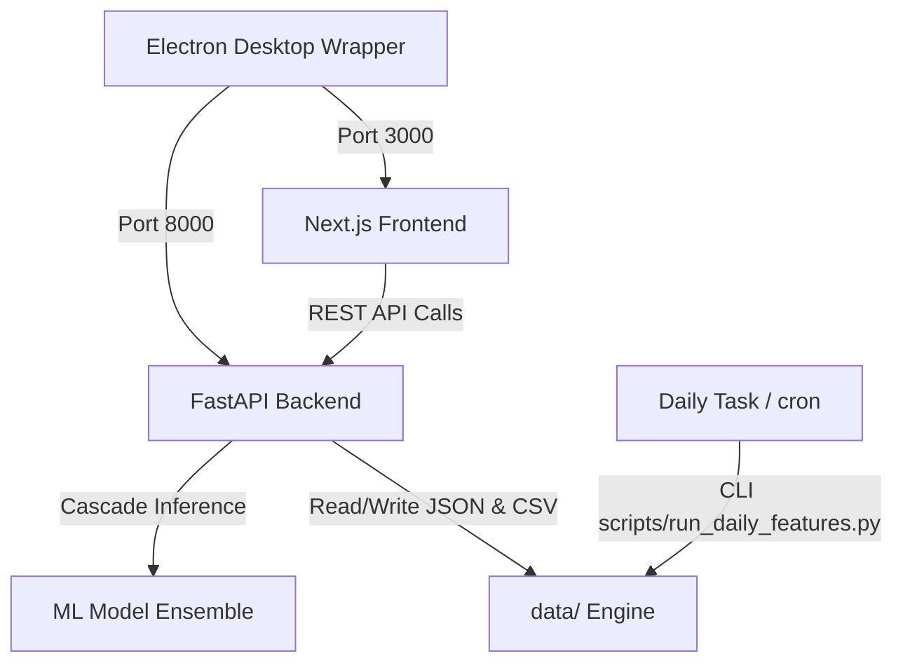

# Organisation du RIE — BNP Paribas El Djazaïr

Système de prévision par intelligence artificielle de la demande de repas, d'aide à la planification des menus et de réduction du gaspillage pour le **Restaurant Inter-Entreprises (RIE)** du siège de **BNP Paribas El Djazaïr**.

---

## 📌 Sommaire

1. [Vue d'ensemble](#vue-densemble)
2. [Architecture technique](#architecture-technique)
3. [Structure du projet](#structure-du-projet)
4. [Prérequis système](#prérequis-système)
5. [Installation & Démarrage](#installation--démarrage)
6. [Configuration & Variables d'environnement](#configuration--variables-denvironnement)
7. [Pipeline Machine Learning & Inférence Live](#pipeline-machine-learning--inférence-live)
8. [Automatisation & Tâche planifiée](#automatisation--tâche-planifiée)
9. [Build Desktop (Electron / Exécutable Windows)](#build-desktop-electron--exécutable-windows)
10. [Documentation & Endpoints API](#documentation--endpoints-api)
11. [Maintenance, Sauvegarde & Résolution d'incidents](#maintenance-sauvegarde--résolution-dincidents)

---

## 🎯 Vue d'ensemble

Le système répond à un défi opérationnel critique : **anticiper quotidiennement le nombre de couverts à servir afin de minimiser le gaspillage alimentaire tout en évitant les ruptures de service**.

### Pipeline de modélisation en Cascade (3 étapes) :
1. **Étape 1 — Prévision de la présence au siège (`office_present`) :** Modèle LightGBM entraîné sur les données calendaires, l'historique et la météo locale (Open-Meteo).
2. **Étape 2 — Estimation du ratio de participation cantine (`ratio = cantine / office`) :** Ensemble pondéré (CatBoost 86.2%, XGBoost 12.1%, LightGBM 1.7%) captant les effets menu (catégories de protéines, encodage TF-IDF) et saisonniers.
3. **Étape 3 — Calibration opérationnelle & Recommandation :** Application du shrinkage, bornage dynamique et marge de sécurité paramétrable (ex. +4%).

---

## 🏗 Architecture technique



- **Frontend :** Next.js 13 (App Router, Tailwind CSS, Radix UI, Lucide Icons, Recharts).
- **Backend :** FastAPI (Python 3.11/3.12, Uvicorn, Pydantic).
- **Desktop Runtime :** Electron wrapper (avec installeur NSIS 64-bit et splash screen).
- **Stockage & Persistance :** Fichiers locaux structurés JSON/CSV sous `data/` (aucun SGBD lourd externe requis, résilient et portable en LAN).
- **Bibliothèque Calendaire :** `holidays` (gestion automatique des jours fériés algériens, français et du calendrier lunaire islamique/Ramadan).

---

## 📁 Structure du projet

```text
rie-project/
├── api/                        # Backend FastAPI
│   ├── main.py                 # Point d'entrée de l'API & configuration CORS
│   ├── forecast.py             # Endpoints d'inférence (live, what-if, horizon)
│   ├── menus.py                # CRUD planification des menus & recalcul automatique
│   ├── operations.py           # Machine d'état du cycle journalier & suivi du gaspillage
│   ├── settings.py             # Paramètres opérationnels (horaires, marges)
│   └── context.py              # Météo et jours fériés
├── dashboard/                  # Frontend Next.js
│   ├── app/                    # Pages de l'application
│   │   ├── (app)/dashboard/    # Vue temps réel & assistant opérationnel du jour
│   │   ├── (app)/forecasts/    # Prévisions de la semaine (dimanche à jeudi)
│   │   ├── (app)/menus-planner/# Planificateur de menus avec recalcul immédiat
│   │   ├── (app)/waste/        # Analyse du gaspillage alimentaire
│   │   ├── (app)/history/      # Historique des services et export CSV
│   │   └── (app)/settings/     # Configuration de l'application
│   ├── lib/                    # API client, types TypeScript, catalogue
│   └── package.json            # Dépendances frontend
├── electron/                   # Application desktop Electron
│   ├── main.js                 # Orchestration du backend et de l'interface
│   ├── preload.js              # Sécurisation du bridge Electron
│   └── package.json            # Configuration electron-builder
├── src/                        # Coeur ML et logique métier
│   ├── forecasting/            # Pipeline de features et cascade ML
│   ├── menu_optimization/      # Catalogue et normalisation des plats
│   ├── calendar_utils.py       # Algorithmes jours fériés / calendrier islamique
│   └── operational_calendar.py # Gestion de la semaine opérationnelle (dim-jeu)
├── data/                       # Données locales (fichiers JSON/CSV - gitignored)
├── models/                     # Modèles ML sérialisés (.pkl/.json)
├── scripts/                    # Scripts d'automatisation et de maintenance
│   ├── run_daily_features.py   # Génération des features pour les N prochains jours
│   ├── install_daily_task.ps1  # Installation de la tâche planifiée Windows
│   ├── start_local_rie.ps1     # Démarrage rapide des services en local
│   └── backup_local_rie.ps1    # Sauvegarde automatique des données
├── tests/                      # Suite de tests unitaires et d'intégration
├── build-desktop.ps1           # Script PowerShell de build complet de l'installeur
├── start-dev.ps1               # Script de démarrage pour l'environnement de dév
├── requirements.txt            # Dépendances Python
└── README.md                   # Ce document
```

---

## ⚙️ Prérequis système

- **Système d'exploitation :** Windows 10/11 ou Windows Server (recommandé pour l'environnement BNP).
- **Python :** Version 3.11 ou 3.12 (64-bit).
- **Node.js :** Version 18.x ou 20.x LTS avec npm.
- **PowerShell :** 5.1 ou PowerShell 7+.

---

## 🚀 Installation & Démarrage

### 1. Cloner le dépôt et configurer l'environnement Python

```powershell
# Cloner le dépôt
git clone https://github.com/Ashreeef/organisation-rie.git
cd rie-project

# Créer l'environnement virtuel Python
py -3.12 -m venv .venv
.\.venv\Scripts\Activate.ps1

# Installer les dépendances Python
pip install -r requirements.txt
```

### 2. Installer les dépendances Frontend

```powershell
cd dashboard
npm install
cd ..
```

### 3. Démarrage des services

#### Méthode A : Démarrage rapide (Script tout-en-un)
```powershell
.\start-dev.ps1
```
*Ce script lance FastAPI sur le port 8000, Next.js sur le port 3000 et ouvre l'application.*

#### Méthode B : Démarrage manuel en deux terminaux
```powershell
# Terminal 1 — Backend FastAPI
.\.venv\Scripts\Activate.ps1
uvicorn api.main:app --host 127.0.0.1 --port 8000 --reload

# Terminal 2 — Frontend Next.js
cd dashboard
npm run dev
```

Accéder ensuite à l'application sur [http://localhost:3000](http://localhost:3000).

---

## 🔐 Configuration & Variables d'environnement

Des fichiers modèles `.env.example` sont fournis à la racine et dans `dashboard/`.

### Fichier racine `.env`
```env
ENVIRONMENT=production
LOG_LEVEL=INFO
CORS_ORIGINS=http://localhost:3000,http://127.0.0.1:3000
API_HOST=127.0.0.1
API_PORT=8000
```

### Fichier `dashboard/.env.local`
```env
NEXT_PUBLIC_API_URL=http://localhost:8000
```

> **Sécurité :** Aucune clé secrète, mot de passe ou donnée personnelle n'est stockée dans le code. Toutes les données réelles sont contenues dans `data/` et sont exclues du suivi Git.

---

## 🤖 Pipeline Machine Learning & Inférence Live

L'inférence live utilise en priorité les features pré-calculées dans `data/processed/features_live.csv`.

Pour calculer ou actualiser les prévisions des 14 prochains jours :
```powershell
python -m src.forecasting.daily_features --days 14
```

- **Météo dynamique :** Récupérée automatiquement via l'API Open-Meteo pour les coordonnées d'Alger (avec repli sur les normales climatiques en cas de coupure réseau).
- **Recalcul automatique :** Chaque modification de menu via l'interface (`/menus-planner`) déclenche immédiatement la régénération des features pour la date concernée.

---

## ⏰ Automatisation & Tâche planifiée (Windows)

Pour garantir que les prévisions soient constamment à jour chaque matin sans intervention manuelle :

```powershell
# Installer la tâche planifiée quotidienne (à 06:00 par défaut)
.\scripts\install_daily_task.ps1

# Personnaliser l'horaire et la profondeur d'horizon
.\scripts\install_daily_task.ps1 -At 06:30 -Days 14

# Tester immédiatement l'exécution de la tâche
.\scripts\install_daily_task.ps1 -RunNow
```

---

## 📦 Build Desktop (Electron / Exécutable Windows)

Pour générer l'installateur Windows autonome (`.exe`) :

```powershell
.\build-desktop.ps1
```

Le script produit un installeur standard NSIS sous `electron/dist/` (et une copie dans `electron/release-1.1.0/`).

---

## 📚 Documentation & Endpoints API

La documentation interactive Swagger est accessible à l'adresse : **[http://localhost:8000/docs](http://localhost:8000/docs)**.

### Principales routes REST :

| Méthode | Route | Description |
|---|---|---|
| `GET` | `/api/health` | Vérification de santé et statut des modèles chargés |
| `GET` | `/api/forecast/today` | Prévision complète du jour (recommandation, marge, intervalle) |
| `POST` | `/api/forecast` | Simulation et prévision avec paramètres personnalisés |
| `GET` | `/api/operations/today` | État du service du jour et progression temporelle |
| `POST` | `/api/operations/{day}/status` | Avancement du cycle de service (`preparation` → `service` → `bilan`) |
| `PUT` | `/api/operations/{day}` | Enregistrement des repas préparés, servis et restants |
| `GET` | `/api/menus` / `POST` `/api/menus` | Consultation et enregistrement des menus planifiés |
| `GET` | `/api/settings` / `PUT` `/api/settings` | Lecture et mise à jour des paramètres d'exploitation |

---

## 🛠 Maintenance, Sauvegarde & Résolution d'incidents

### 1. Sauvegarde des données
Exécuter régulièrement le script de sauvegarde :
```powershell
.\scripts\backup_local_rie.ps1
```
Les archives sont stockées dans le dossier horodaté `backups/`.

### 2. Procédure de redémarrage en cas de blocage
1. Tuer les processus éventuels orphelins :
   ```powershell
   taskkill /F /IM uvicorn.exe /T
   taskkill /F /IM node.exe /T
   ```
2. Relancer les services via `.\start-dev.ps1` ou `.\scripts\start_local_rie.ps1`.
3. Vérifier le point de santé : [http://localhost:8000/api/health](http://localhost:8000/api/health).
